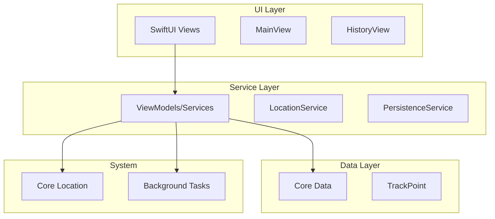
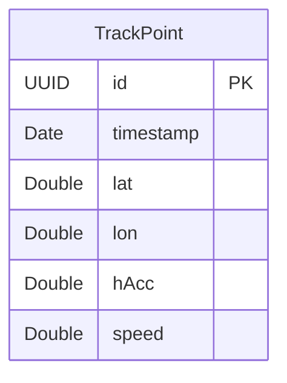
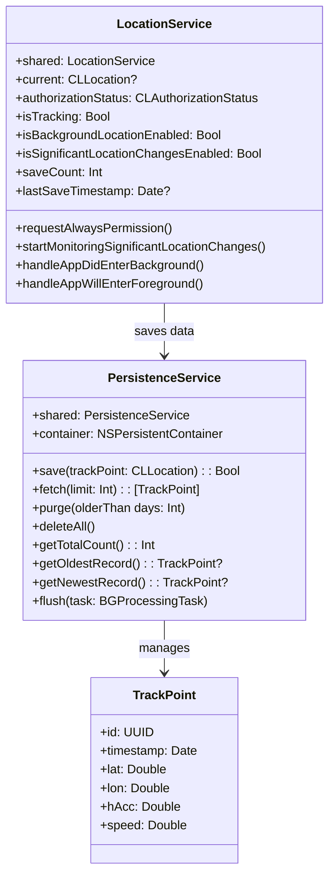
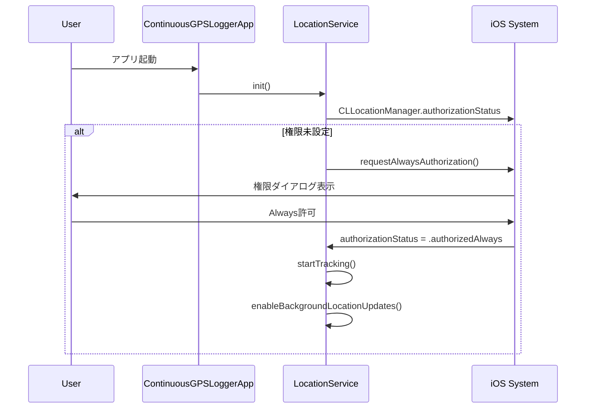
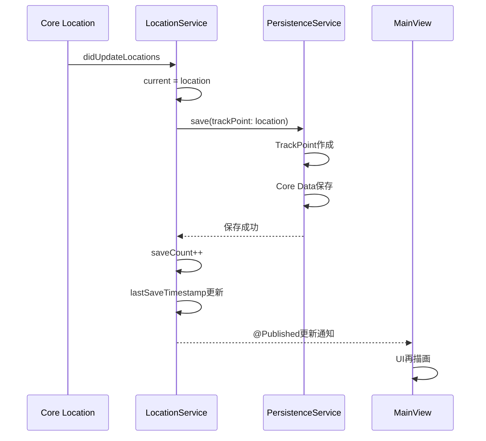
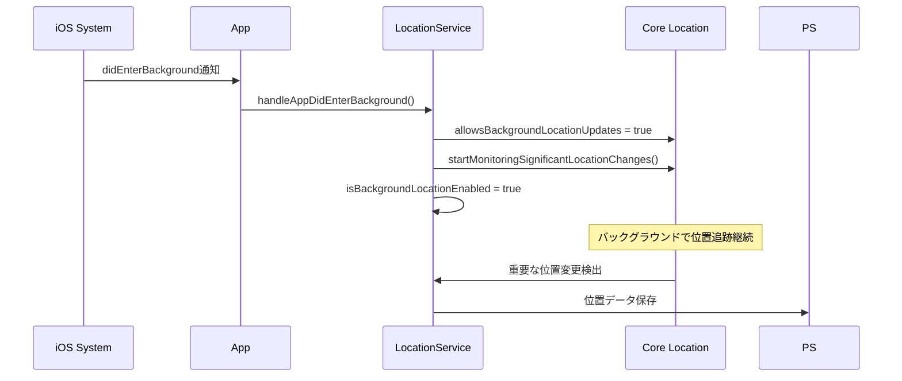
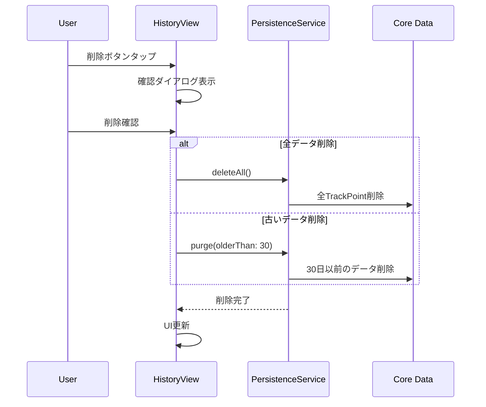
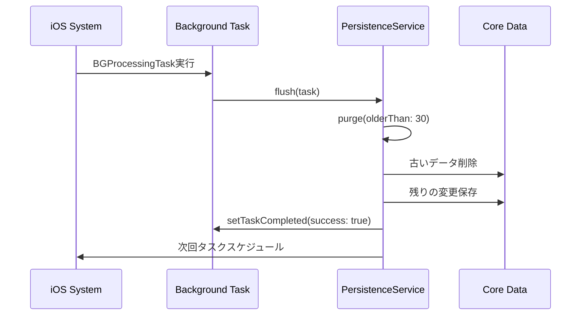

# ContinuousGPSLogger - 開発・運用ドキュメント

## 概要

ContinuousGPSLoggerは、iOS デバイスで継続的な GPS 位置情報を記録するSwiftUIアプリケーションです。アプリがバックグラウンドで実行されている場合や、ユーザーがアプリを終了した場合でも位置追跡を継続し、データを永続化します。

## 主要機能

- リアルタイム位置情報の取得と表示
- 位置データの自動保存（Core Data）
- 履歴の表示と管理（100件制限）
- バックグラウンド位置追跡
- データ削除と最適化機能
- 位置情報権限の適切な管理

## アーキテクチャ

### 全体構成



### アーキテクチャパターン

- **MVVM + サービス層**: UI とビジネスロジックの分離
- **シングルトンサービス**: LocationService、PersistenceService
- **Reactive Programming**: @Published プロパティによる状態管理
- **@MainActor**: UIスレッドでの安全な操作保証

### 技術スタック

- **フレームワーク**: SwiftUI (iOS 18+)
- **位置情報**: Core Location Framework
- **データ永続化**: Core Data
- **バックグラウンド処理**: Background Tasks Framework
- **並行処理**: Swift Concurrency (@MainActor, Task)

## データモデル（静的モデル）

### Core Data エンティティ

#### TrackPoint
位置情報の記録を表現するエンティティ



**属性詳細:**
- `id`: 一意識別子（UUID）
- `timestamp`: 位置記録時刻
- `lat`: 緯度（度）
- `lon`: 経度（度）
- `hAcc`: 水平精度（メートル）
- `speed`: 速度（m/s）

### サービス層クラス図



## 利用可能なユースケース

### 1. 位置情報権限取得
- **アクター**: ユーザー
- **目的**: アプリが位置情報にアクセスできるようにする
- **前提条件**: アプリが初回起動または権限が未設定
- **成功条件**: Always権限が取得される

### 2. リアルタイム位置追跡
- **アクター**: システム
- **目的**: 現在位置を継続的に取得し表示する
- **前提条件**: 位置情報権限が許可済み
- **成功条件**: 位置情報が画面に表示され、自動保存される

### 3. 履歴データ管理
- **アクター**: ユーザー
- **目的**: 保存された位置履歴の確認と削除
- **前提条件**: 位置データが保存済み
- **成功条件**: 履歴が表示され、必要に応じて削除できる

### 4. バックグラウンド位置追跡
- **アクター**: システム
- **目的**: アプリ終了後も位置追跡を継続する
- **前提条件**: Always権限が許可済み
- **成功条件**: アプリ非アクティブ時も位置データが記録される

### 5. データ最適化
- **アクター**: システム
- **目的**: 古いデータの自動削除とパフォーマンス維持
- **前提条件**: 大量のデータが蓄積
- **成功条件**: 古いデータが削除され、快適な動作が維持される

## 動的モデル（シーケンス図）

### 1. アプリ起動と権限取得



### 2. リアルタイム位置追跡と保存



### 3. バックグラウンド状態移行



### 4. 履歴データ削除



### 5. バックグラウンドタスク実行



## プロジェクト構造

```
ContinuousGPSLogger/
├── ContinuousGPSLoggerApp.swift          # アプリエントリーポイント
├── Info.plist                           # アプリ設定・権限
├── GPSLogger.xcdatamodeld/               # Core Dataモデル
├── Sources/
│   └── Services/
│       ├── LocationService.swift        # 位置情報サービス
│       ├── PersistenceService.swift     # データ永続化サービス
│       └── PersistenceService+BG.swift  # バックグラウンドタスク
├── Views/
│   ├── MainView.swift                   # メイン画面
│   ├── HistoryView.swift                # 履歴画面
│   └── PermissionGuidanceView.swift     # 権限ガイダンス
└── docs/                                # ドキュメント
    ├── stagedImplementationPlan.md      # 実装計画
    ├── stage5DetailedPlan.md           # Stage4詳細計画
    ├── stage5BackgroundDetailedPlan.md # Stage5詳細計画
    └── DEVELOPMENT.md                   # 本ドキュメント
```

## 開発ガイド

### 環境要件

- **Xcode**: 15.0+
- **iOS**: 18.0+
- **Swift**: 5.9+
- **デバイス**: GPS機能付きiOSデバイス（実機テスト推奨）

### ビルドコマンド

```bash
# プロジェクトディレクトリで実行

# ビルド
xcodebuild -scheme ContinuousGPSLogger -configuration Debug build

# シミュレーターでビルド
xcodebuild -scheme ContinuousGPSLogger -configuration Debug -destination 'platform=iOS Simulator,name=iPhone 16' build

# テスト実行
xcodebuild -scheme ContinuousGPSLogger -configuration Debug test

# クリーン
xcodebuild -scheme ContinuousGPSLogger clean
```

### 開発時の注意点

#### 1. 位置情報権限

- **シミュレーター**: Features > Location > Custom Location で位置設定
- **実機**: Settings > Privacy & Security > Location Services でアプリ権限確認
- **Always権限**: バックグラウンド追跡には必須

#### 2. バックグラウンドテスト

- **実機必須**: シミュレーターではバックグラウンド位置更新が正常動作しない
- **Debug Menu**: Xcode > Debug > Simulate Background App Refresh
- **位置変更**: 実際に移動してテストする

#### 3. Core Data

- **マイグレーション**: モデル変更時は慎重に
- **パフォーマンス**: 大量データでのメモリ使用量に注意
- **バックアップ**: データ削除機能のテスト時は注意

### テスト戦略

#### 1. ユニットテスト

```swift
// LocationServiceのテスト例
func testLocationSaving() {
    let service = LocationService.shared
    let initialCount = service.saveCount
    
    // 位置データのモック作成とテスト
    // ...
}
```

#### 2. 統合テスト

- 位置情報取得→保存→表示の一連のフロー
- バックグラウンド移行→位置更新→データ保存
- 削除機能→UI更新の確認

#### 3. 実機テスト

- GPXファイルを使った位置データシミュレーション
- 実際の移動による位置追跡テスト
- アプリ終了→位置変更→復帰のシナリオテスト

## 運用ガイド

### 監視項目

- **データ使用量**: Core Dataのサイズ監視
- **バッテリー消費**: 位置追跡の電力使用量
- **クラッシュ**: バックグラウンド実行時のエラー
- **権限状態**: ユーザーの権限変更の検出

### パフォーマンス最適化

#### 1. データ管理

```swift
// 自動削除の設定例
if totalCount > 1000 {
    PersistenceService.shared.purge(olderThan: 30)
}
```

#### 2. 位置精度調整

```swift
// 電力消費を抑えたい場合
manager.desiredAccuracy = kCLLocationAccuracyHundredMeters
```

#### 3. バックグラウンド最適化

- 重要な位置変更のみ監視
- 不要な位置更新の停止
- バッテリー残量に応じた動作調整

### トラブルシューティング

#### 1. 位置情報が取得できない

**症状**: current位置がnilのまま
**原因と対策**:
- 権限確認: Settings > Privacy > Location Services
- GPS信号: 屋外での確認
- シミュレーター: カスタム位置の設定確認

#### 2. バックグラウンド追跡が動作しない

**症状**: アプリ終了後に位置データが記録されない
**原因と対策**:
- Always権限の確認
- Background App Refreshの有効化確認
- 実機でのテスト実施

#### 3. データが保存されない

**症状**: saveCountが増加しない
**原因と対策**:
- Core Dataスタックの初期化確認
- エラーログの確認
- ストレージ容量の確認

#### 4. アプリがクラッシュする

**症状**: バックグラウンドでクラッシュ
**原因と対策**:
- メモリ使用量の確認
- Core Dataのコンテキスト操作の見直し
- バックグラウンドタスクの制限時間対応

### App Store申請時の注意

#### 1. 位置情報の利用目的

- Info.plistの利用目的説明を明確に記載
- スクリーンショットで機能説明
- レビューガイドラインの遵守

#### 2. バックグラウンド実行

- 必要性の明確な説明
- ユーザーへの適切な通知
- 電力消費の最適化

#### 3. プライバシー

- 位置データの取り扱い方針
- データの外部送信がないことの明記
- ユーザーコントロールの提供

## 今後の拡張可能性

### 1. 機能拡張

- **データエクスポート**: GPX、CSV形式での出力
- **地図表示**: MapKitを使った履歴の可視化
- **統計機能**: 移動距離、平均速度の計算
- **ジオフェンス**: 特定エリアでの通知機能

### 2. 技術的改善

- **SwiftData移行**: iOS 17+での新しいデータフレームワーク
- **WidgetKit**: ホーム画面ウィジェットでの状態表示
- **CloudKit**: iCloud同期機能
- **WatchKit**: Apple Watchでの操作

### 3. パフォーマンス

- **データ圧縮**: 長期間のデータ保存最適化
- **インデックス**: 検索性能の向上
- **キャッシュ**: UI表示の高速化

## 参考資料

- [Core Location Framework](https://developer.apple.com/documentation/corelocation)
- [Background Tasks Framework](https://developer.apple.com/documentation/backgroundtasks)
- [Core Data Programming Guide](https://developer.apple.com/library/archive/documentation/Cocoa/Conceptual/CoreData/)
- [SwiftUI Documentation](https://developer.apple.com/documentation/swiftui)
- [App Store Review Guidelines](https://developer.apple.com/app-store/review/guidelines/)

---

**最終更新**: 2025-07-06  
**バージョン**: Stage 5 完了版