# ContinuousGPSLogger システム構成図・シーケンス図

## 概要

このドキュメントは、ContinuousGPSLogger のシステム構成とデータフローを視覚的に説明します。

---

## 1. システム全体構成図

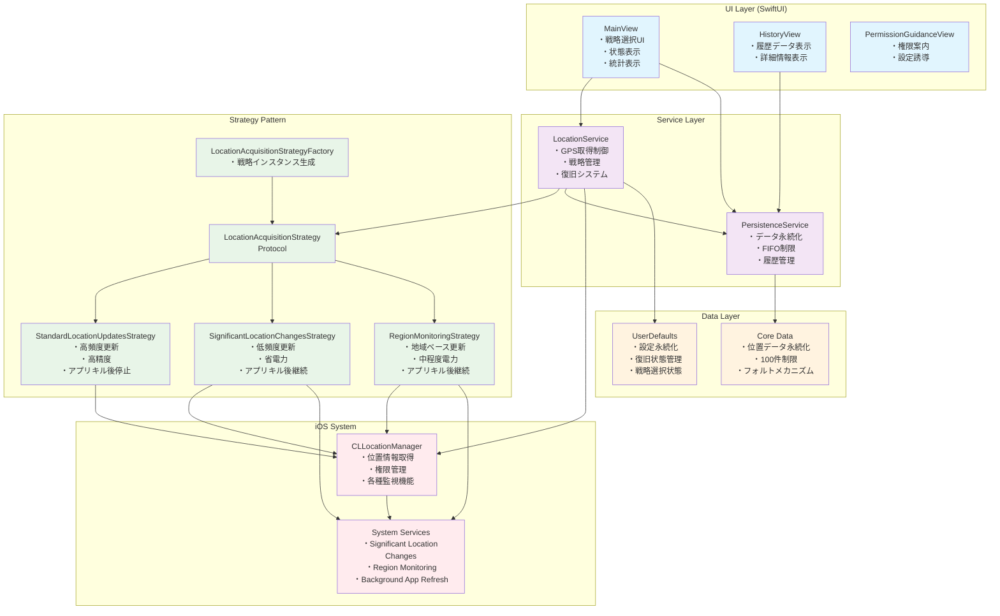

---

## 2. Strategy Pattern 詳細構成図

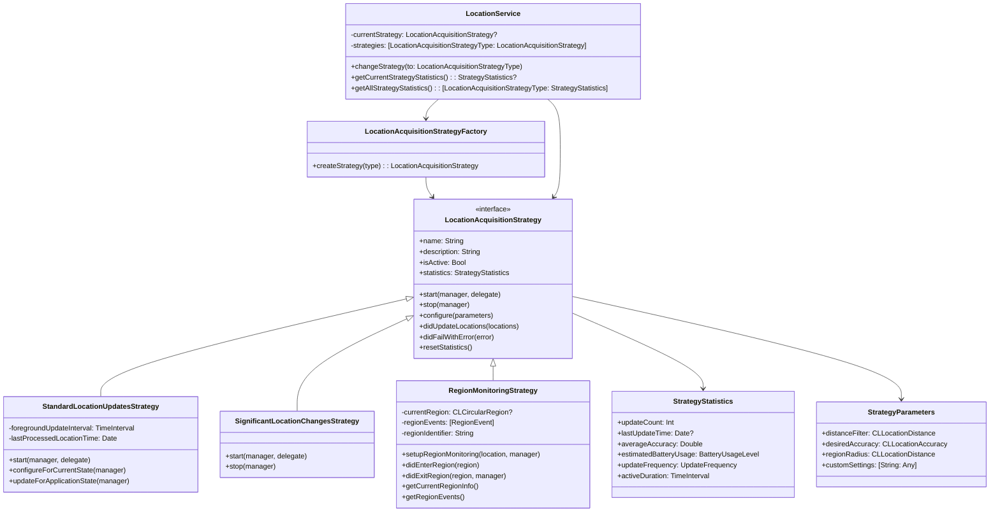

---

## 3. データフロー図

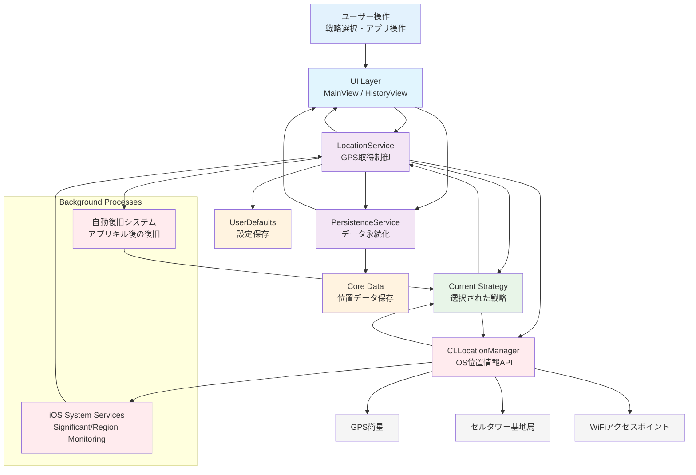

---

## 4. シーケンス図集

### 4.1 アプリ起動・初期化シーケンス

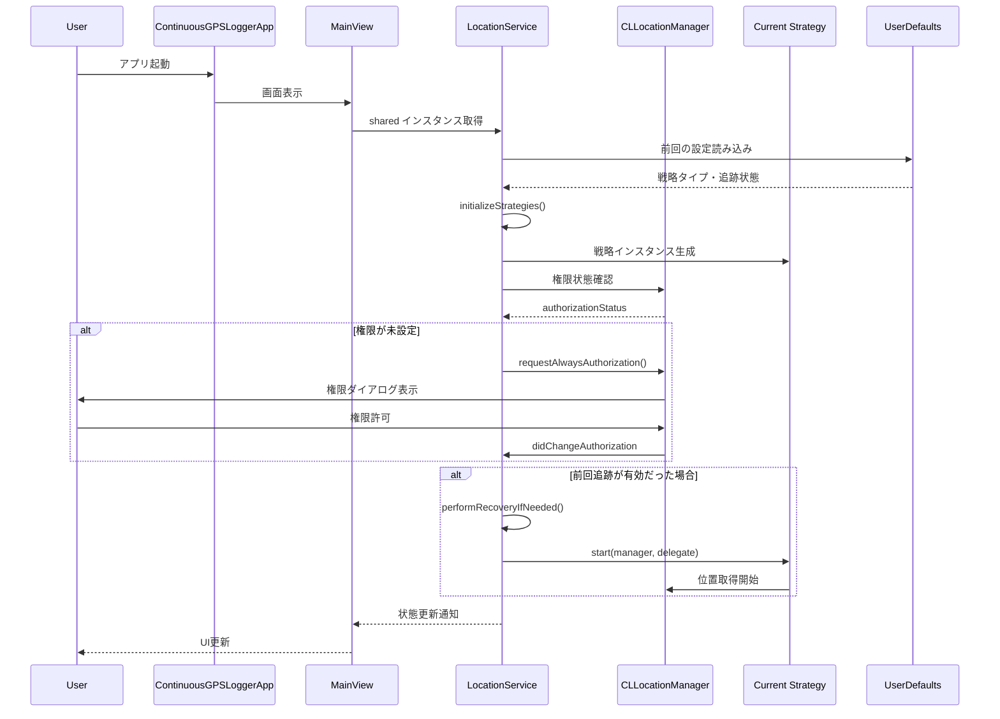

### 4.2 戦略切り替えシーケンス

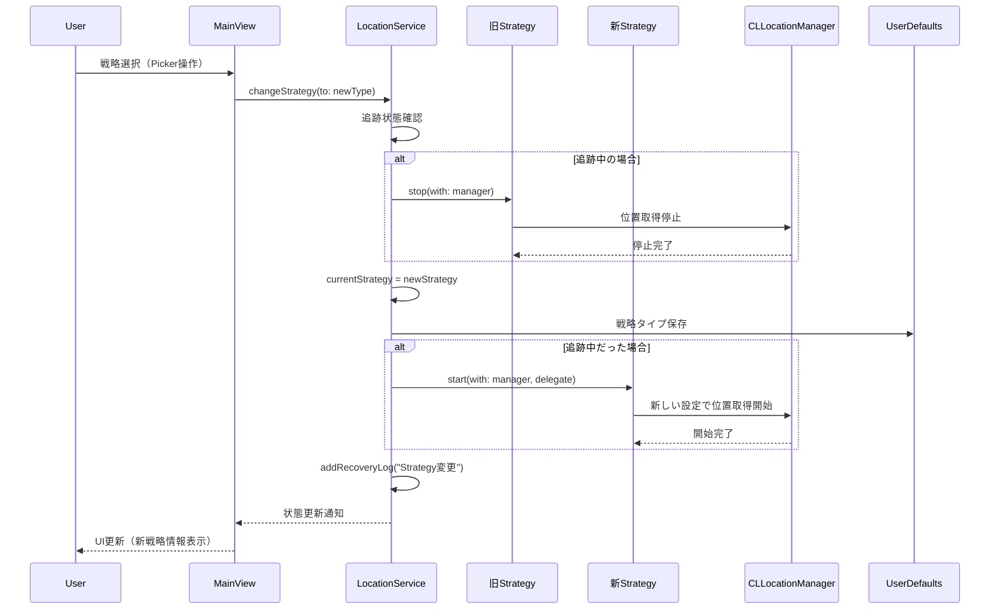

### 4.3 GPS 位置取得・保存シーケンス

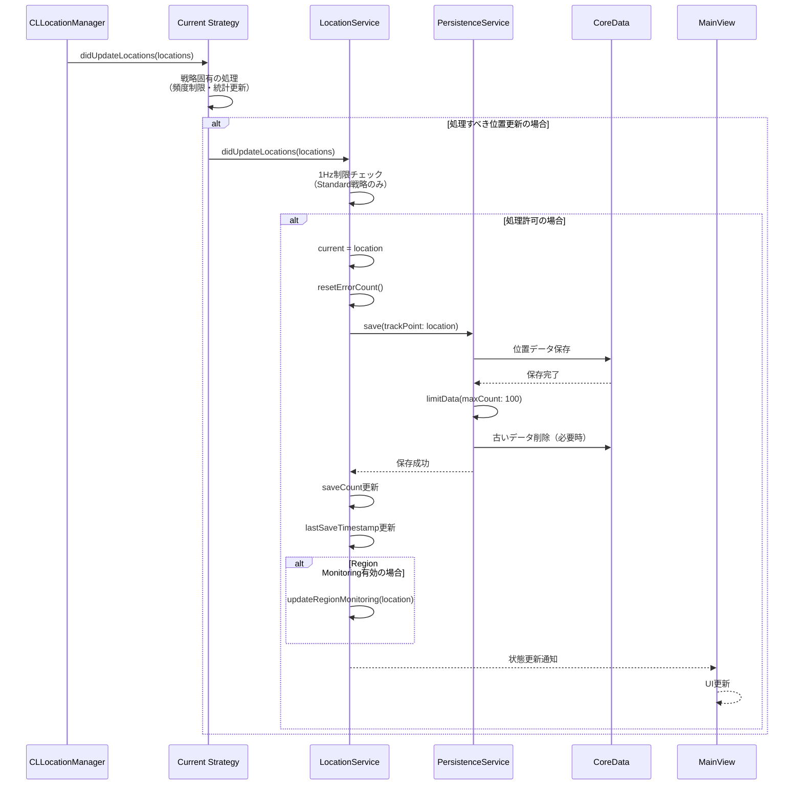

### 4.4 アプリキル後復旧シーケンス

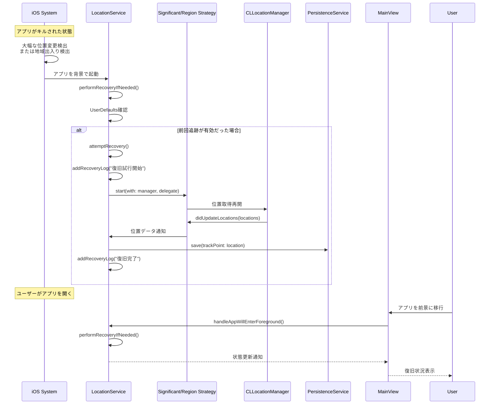

### 4.5 エラーハンドリング・復旧シーケンス

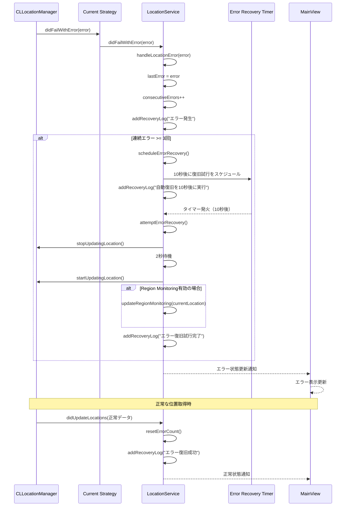

### 4.6 Strategy 別動作比較シーケンス

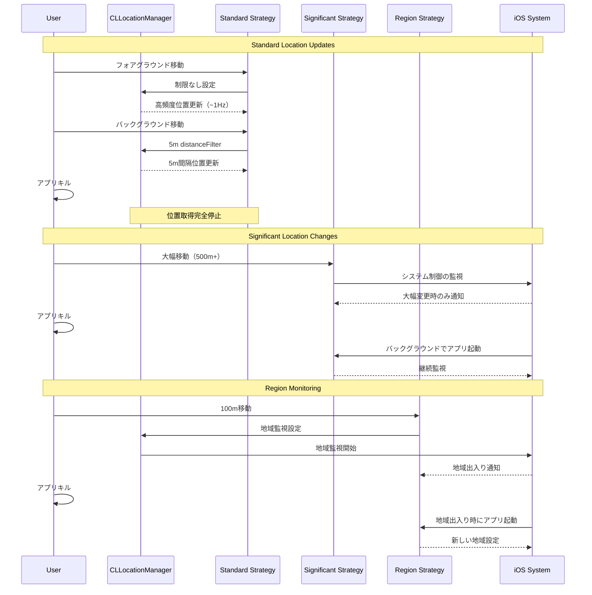

---

## 5. 状態遷移図

### 5.1 アプリケーション状態遷移

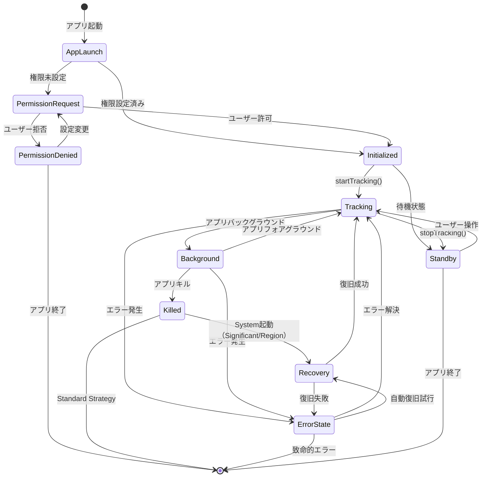

### 5.2 Strategy 状態遷移

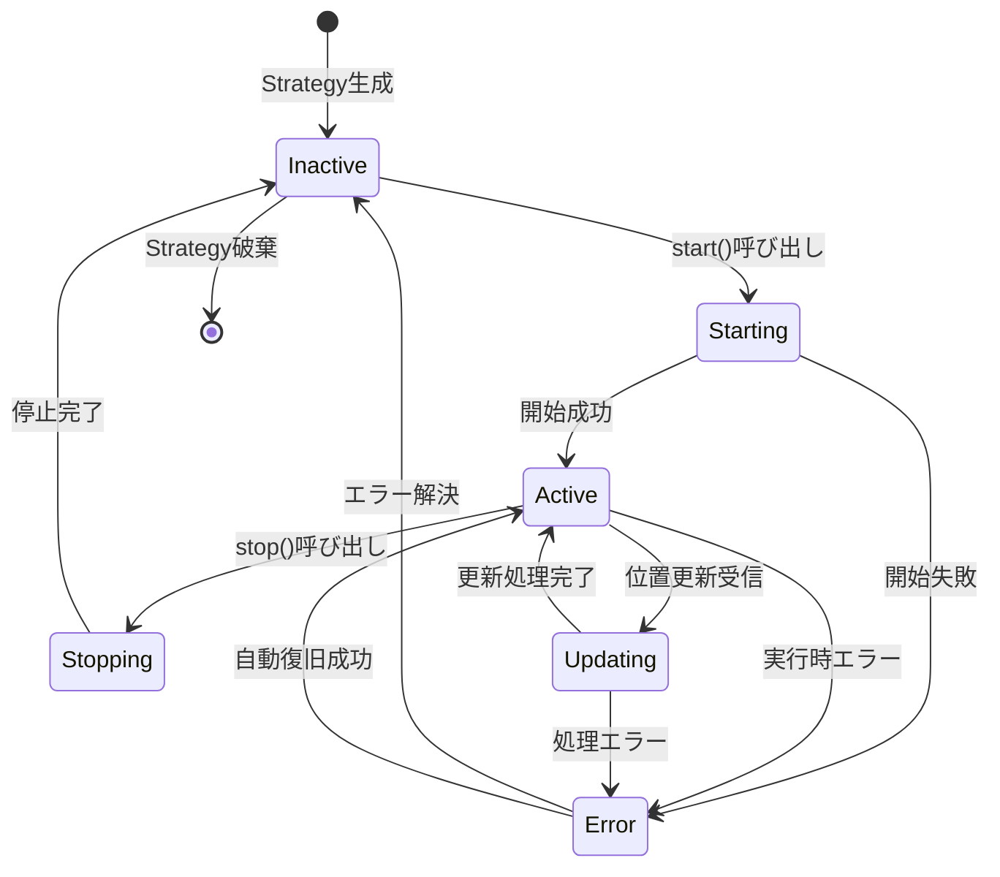

---

## 6. 補足説明

### 6.1 図表の読み方

#### システム構成図

- **青色**: UI 層コンポーネント
- **紫色**: サービス層コンポーネント
- **緑色**: Strategy 層コンポーネント
- **オレンジ色**: データ層コンポーネント
- **赤色**: iOS システム層コンポーネント

#### シーケンス図

- **実線矢印**: 同期呼び出し
- **破線矢印**: 非同期通知・コールバック
- **alt ブロック**: 条件分岐
- **Note**: 補足説明

#### 状態遷移図

- **角丸四角**: 状態
- **矢印**: 状態遷移
- **[*]**: 開始・終了状態

### 6.2 重要なポイント

1. **Strategy Pattern**: 実行時に異なる GPS 取得方式を切り替え可能
2. **復旧システム**: アプリキル後の自動復旧機能
3. **データフロー**: 位置データの取得から保存まで一貫した流れ
4. **エラーハンドリング**: 段階的なエラー復旧システム
5. **状態管理**: アプリ・Strategy 別の詳細な状態追跡

### 6.3 パフォーマンス考慮事項

- **メモリ効率**: Strategy インスタンスの事前生成・再利用
- **CPU 効率**: メインスレッド負荷の分散
- **電力効率**: 戦略別の最適化された設定
- **データ効率**: FIFO 制限による一定メモリ使用量
